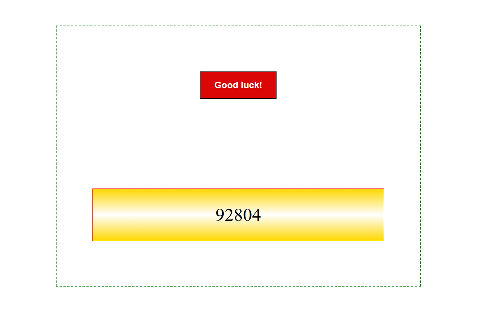
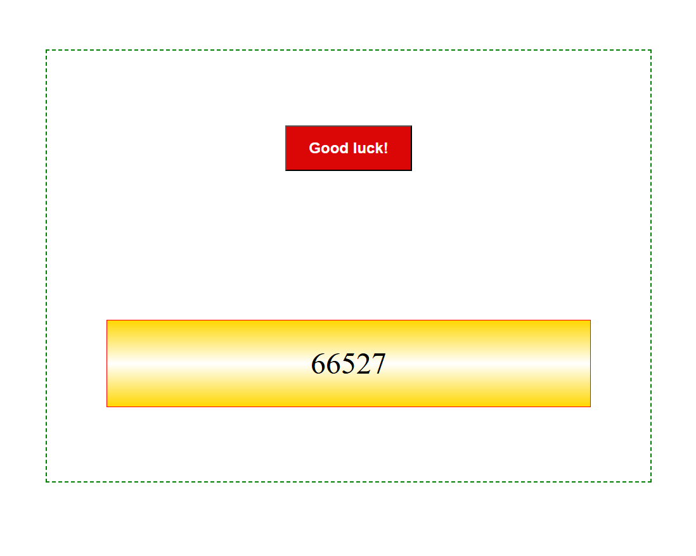
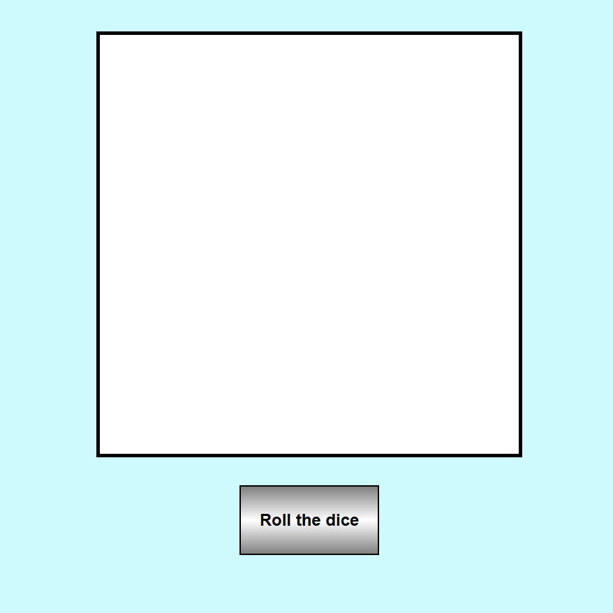
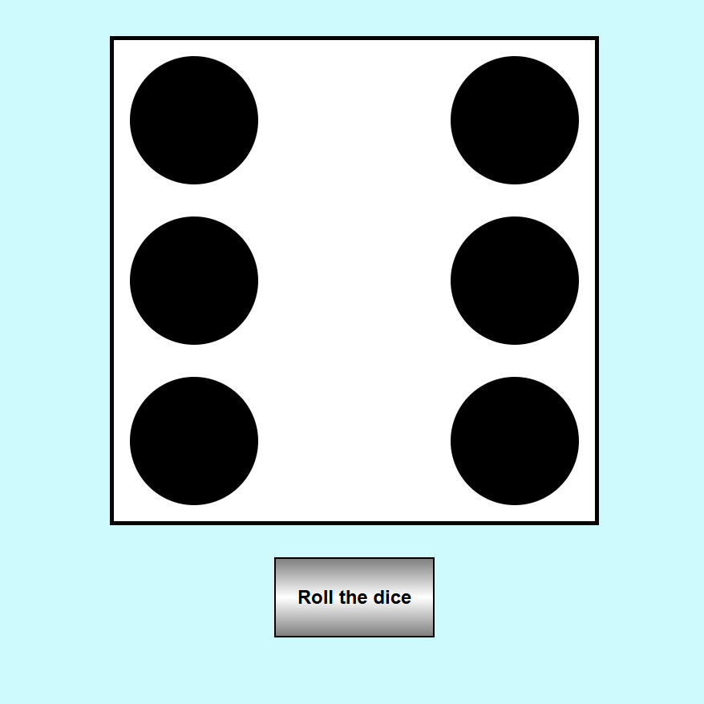

# Lenguaje de marcas

- [HTML + CSS + JavaScript](#HTML+CSS+JavaScript)

    - [Bombilla](#bombilla)
    - [Loteria](#loteria)
    - [Dado](#dado)
 
 

## HTML + CSS + JavaScript

### Bombilla

Al pulsar el botón "On/Off" la bombilla se enciende y se apaga y muestra la hora en la que se realizó cada acción.

 

<table align="center">
  <tr>
    <td></td>
    <td></td>
    <td></td>
  </tr>
</table>

### Lotería

Al pulsar el botón de "Good luck!" aparece un número de cinco cifras al azar.

 

<table align="center">
  <tr>
    <td></td>
    <td></td>
  </tr>
</table>

### Dado

Al pulsar el botón "Roll the dice" aparece un número del 1 al 6 al azar.

 

<table align="center">
  <tr>
    <td></td>
    <td></td>
  </tr>
</table>
