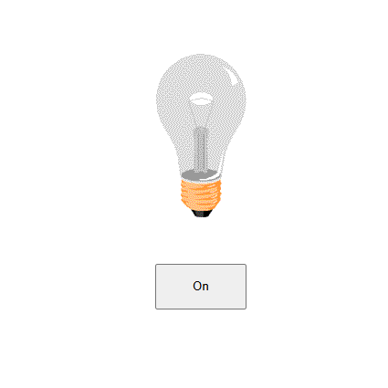
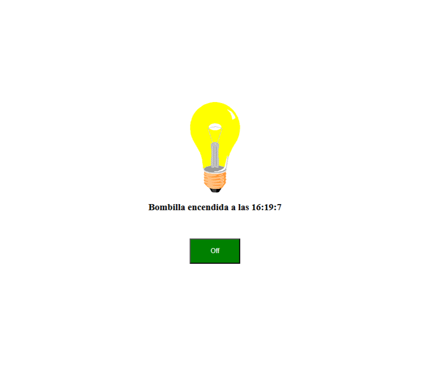
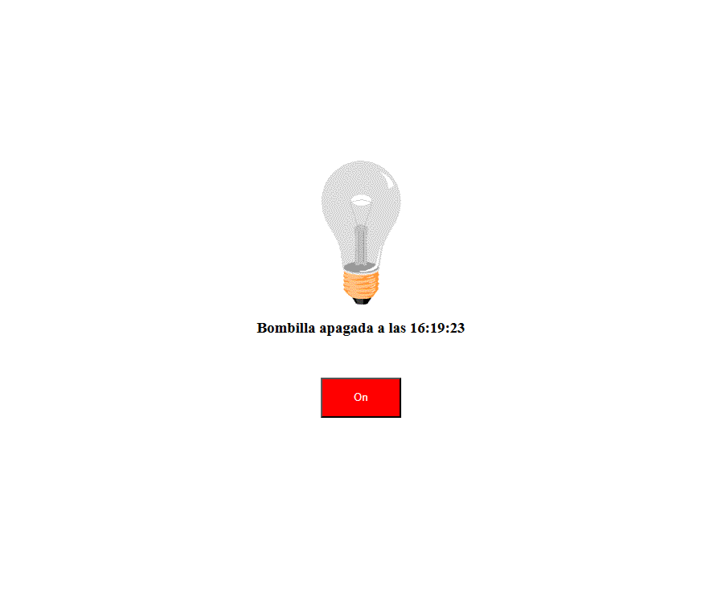

# Lenguaje de marcas

- [HTML + CSS + JavaScript](#HTML+CSS+JavaScript)

    - [Bombilla](#bombilla)

## HTML + CSS + JavaScript

### Bombilla

Al pulsar el botón la bombilla se enciende y se apaga y muestra la hora en la que se realizó cada acción.

 

<table align="center">
  <tr>
    <td></td>
    <td></td>
    <td></td>
  </tr>
</table>
