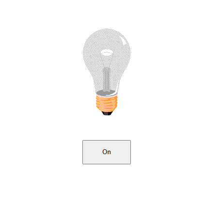
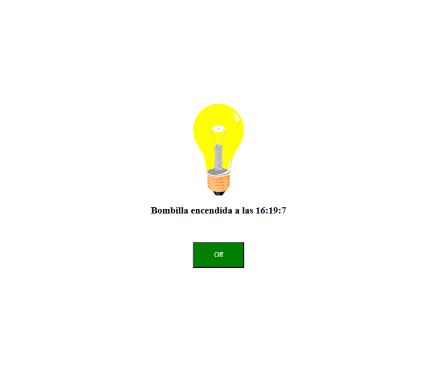
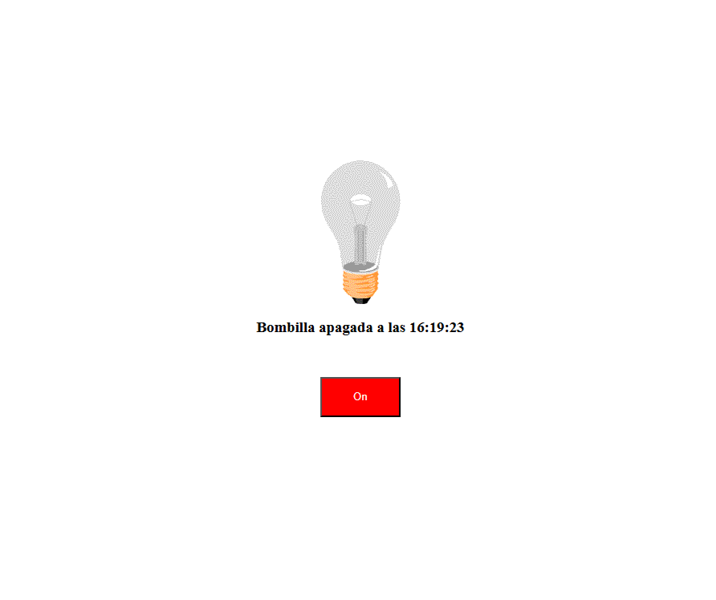
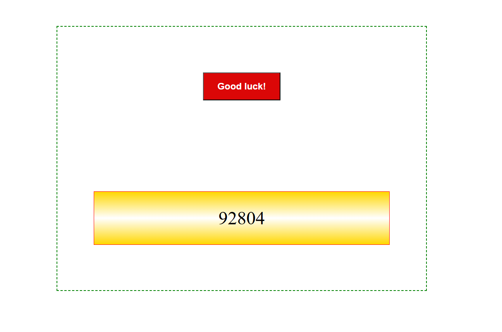
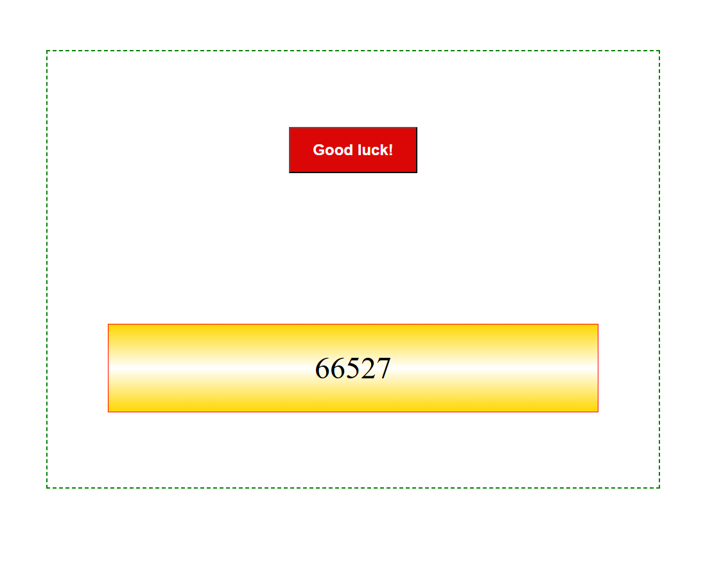
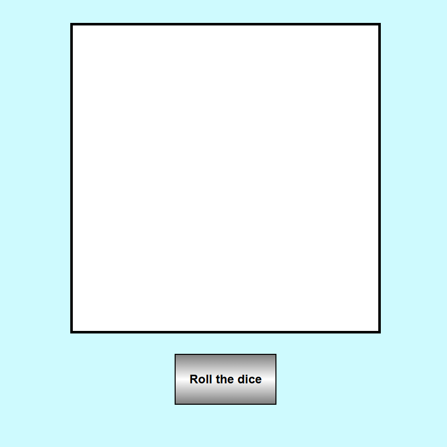
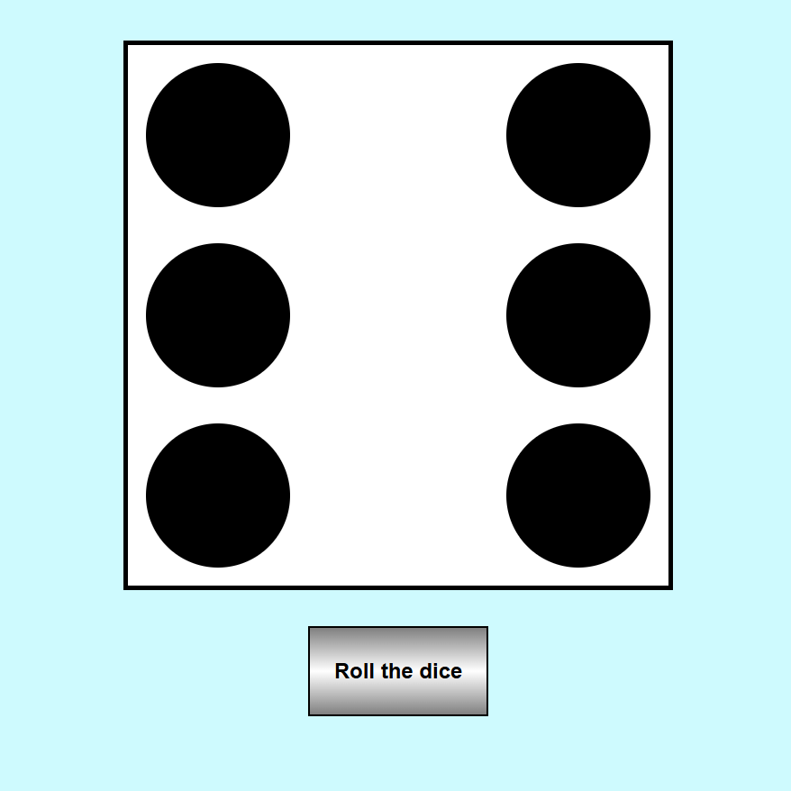
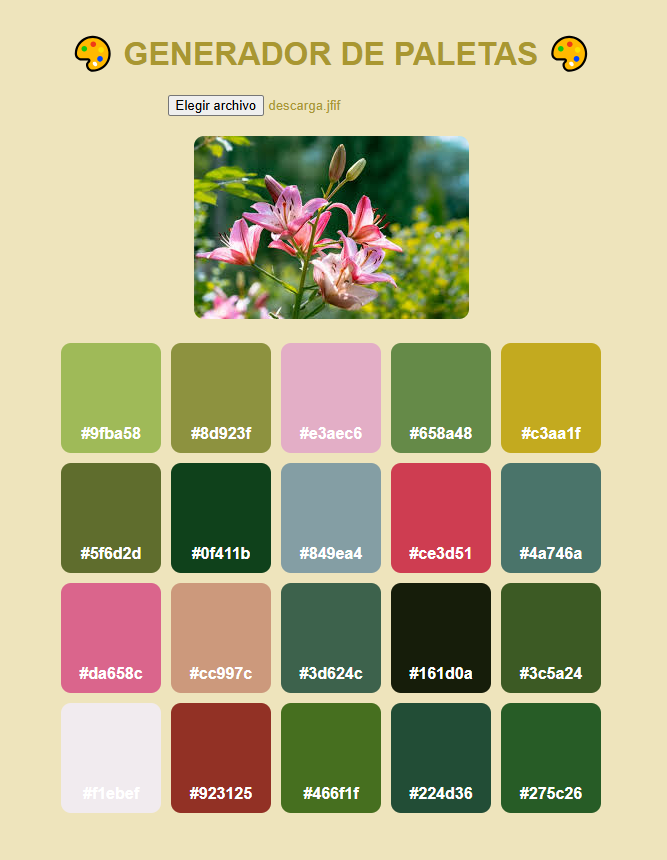

# Lenguaje de marcas

- [HTML + CSS](#HTML+CSS)
    - [Simulador de creación de una cuenta](#crearcuenta)
- [HTML + CSS + JavaScript](#HTML+CSS+JavaScript)

    - [Bombilla](#bombilla)
    - [Loteria](#loteria)
    - [Dado](#dado)
    - [Bloc de notas](#blocdenotas)
    - [Paleta de colores](#paletadecolores)
    - [Memory Card Game](#memorycardgame)
 
 

## HTML + CSS

### Simulador de creación de una cuenta

Interfaz gráfica de un formulario que permite introducir tus datos para crear una cuenta.

 

 

## HTML + CSS + JavaScript

### Bombilla

Al pulsar el botón "On/Off" la bombilla se enciende y se apaga y muestra la hora en la que se realizó cada acción.

 

<table align="center">
  <tr>
    <td></td>
    <td></td>
    <td></td>
  </tr>
</table>

### Lotería

Al pulsar el botón de "Good luck!" aparece un número de cinco cifras al azar.

 

<table align="center">
  <tr>
    <td></td>
    <td></td>
  </tr>
</table>

### Dado

Al pulsar el botón "Roll the dice" aparece un número del 1 al 6 al azar.

 

<table align="center">
  <tr>
    <td></td>
    <td></td>
  </tr>
</table>

## Bloc de notas

Bloc de notas. Se pueden buscar, fijar y aparece la fecha en la que se crea.

 

## Paleta de colores

Al subir una imagen detecta los colores en la misma para crear una paleta de colores.

 

## Memory Card Game

El clásico juego de memorizar cartas. Cuenta los movimientos realizados como puntuación.

 

<table align="center">
  <tr>
    <td></td>
    <td></td>
  </tr>
</table>

